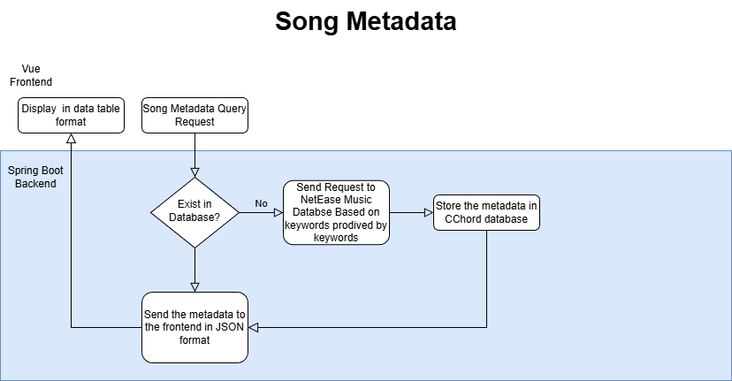
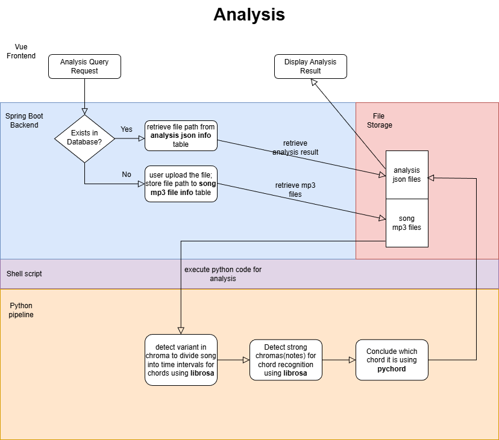

<p align="center">
  
</p>

<h1 align="center">C-Chord</h1>

<p align="center">
  <b>A web-based chord recognition tool powered by Spring Boot + Vue.js + Python</b>
</p>

## How to Run

**Note:**  
This project runs using **Docker**. Please make sure you have **Docker Desktop** (Windows/macOS).  
Please allocate at least **10 GB** of memory to Docker Desktop to ensure the chord analysis works properly.    
If the port **8848** is already in use, close the conflicting process or update the port mapping inside **docker-compose.yml**.  
### macOS / Linux

```bash
git clone https://github.com/Illudrepher/CMajorChord.git
cd CMajorChord/deploy
docker compose up --build -d  
```

### Windows  

```PowerShell  
git clone https://github.com/Illudrepher/CMajorChord.git  
cd CMajorChord\deploy  
docker compose up --build -d  
```
<h3>Then access the application at http://localhost:8848</h3>  

## Preview  
### 1. Song Search (powered by NetEase)
<p align="center">
  
</p>

### 2. File Upload & Analysis
<p align="center">
  
</p>

### 3. Query Cached Analysis Result (no recomputation)
<p align="center">
  
</p>

## Flowcharts  
**Flowchart for song metadata**  
<p align="center">
  
</p>

**FlowChart for Analysis Data**  
**Note: mp3 files are renamed to their hash256 to avoid file name conflict and to ensure safety**  
<p align="center">
  
</p>

## Description

### Ideas / Purposes

C-Chord is a web-based chord recognition system that analyzes uploaded audio and caches the resulting chord segments for fast re-queries.

- The project originated from my need to verify chord progressions while learning music composition. Existing tools for beginners were limited, especially for checking manual transcriptions. C-Chord addresses this gap by automating the chord recognition process through a custom Python-based analysis pipeline, while caching computed results for fast retrieval.
- Metadata (song name, artist, and a hashed composite ID based on source and source-specific ID) is retrieved from the NetEase Music API and stored locally to reduce repeated API calls and allow future extensibility.
- C-Chord also serves as a personal student project for my Master’s applications, demonstrating my abilities in full-stack development, system design, and Python scripting.

---

### Features

- **Song search** powered by NetEase API  
- **Automatic audio separation** using Spleeter  
- **Chord recognition pipeline** using Librosa chroma + pychord  
- **Caching system** to avoid repeated computation (Spring Boot + MySQL)  
- **Interactive frontend UI** built with Vue 3 and Naive UI  

---

### Technical Details for python MIR script  
- The script first gets time intervals by checking if a major chroma shift occurs. This step helps generate time boundaries for each chord, which is essential for chord recognition and pseudo real-time chord display.  
- For note detection, the note with the second strongest average chroma in an interval is selected as the standard note to evaluate whether other notes are included, as it works best after some initial exploration.    
- For note detection, no more than five notes are considered within one interval, as this makes more musical sense.  
- For chord recognition, the script runs through every possible permutation, and keeps scoring the corresponding chord, the shorter the chord name is, the higher the score. The chord with the best score is kept as the final result. Although this approach makes sense for songs with simpler harmony, for more complicated songs, this assumption will fall short.

---


### Limitations & Future Improvements

- Initially, I intended to stream and analyze audio directly from NetEase, but this proved both technically challenging and legally infeasible. As a result, C-Chord relies on user-uploaded MP3 files. A production-ready system would require integration with licensed music services.
  
- The accuracy of the chord recognition algorithm is limited.  
  - Chord detection is inherently difficult and remains an active research challenge.  
  - Chroma-based methods, while efficient, are sensitive to noise and harmonic ambiguity.  
  - Although this project incorporates noise reduction and dynamic thresholding, the results are not yet ideal.

  Future improvements may include:
  - adopting more advanced chord detection techniques  
  - integrating machine-learning-based or template-based methods  
  - improving onset detection and harmonic modeling  
  - exploring large-scale pretrained audio models  

## Tech Stack

---

### Frontend
- **Vue 3** — UI framework  
- **Naive UI** — component library for UI  
- **Axios** — API communication  

### Backend
- **Spring Boot** — API layer and service orchestration  
- **Java** — backend logic, routing, and cache control  
- **MySQL** — persistent storage for metadata and analysis results (managed via JPA)  

### Python (Audio Processing)
- **Librosa** — chroma extraction and onset detection utilities  
- **Spleeter** — audio source separation (4-stem)  
- **pychord** — chord name inference  
- Custom scripts for segment processing and threshold tuning  

### Deployment / Infrastructure
- **Docker Compose** — multi-service orchestration (frontend, backend, Python processing pipeline)  
- **Docker** — consistent execution environment across systems  

### APIs / External Services
- **NetEase Cloud Music API** — song search and metadata retrieval


